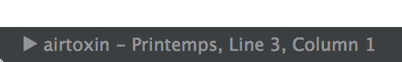

# Sublime-iTunes 

Show iTunes playing track on sublime status bar.

Only support `OSX` and `Sublime Text 3`.

## Installation

__todo__

You can install from [Package Control](https://sublime.wbond.net/).

__Package Control: Install Package__ > Select __iTunes__

## Settings

+ auto_hide: auto hide nowplaying (`true` or `false`)
+ hide_msec: timeout of `auto_hide` (0<=`hide_msec`)
+ polling_msec: todo
